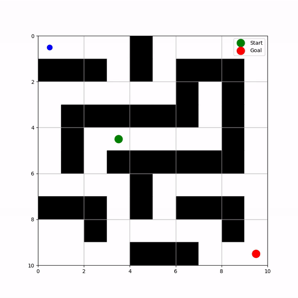

# Dynamic Path Planning and SLAM Integration

This project demonstrates dynamic path planning using the A* algorithm integrated with SLAM (Simultaneous Localization and Mapping) for real-time environment mapping and navigation. It showcases how an autonomous robot can navigate through a 2D grid-based environment, detect obstacles, and dynamically re-plan its path.

## Features

- **A* Algorithm** for optimal pathfinding in a grid environment.
- **Extended Kalman Filter (EKF) SLAM** to update robot position and orientation.
- **Dynamic Path Replanning** in response to new obstacles detected in the environment.
- **Matplotlib Visualization** of the robot's path.
- **Video Export** of the robot’s navigation for easy sharing and analysis.

## Usage

### Installation

Install the necessary libraries:

```bash
pip install matplotlib numpy scipy
```
### A* traversal

